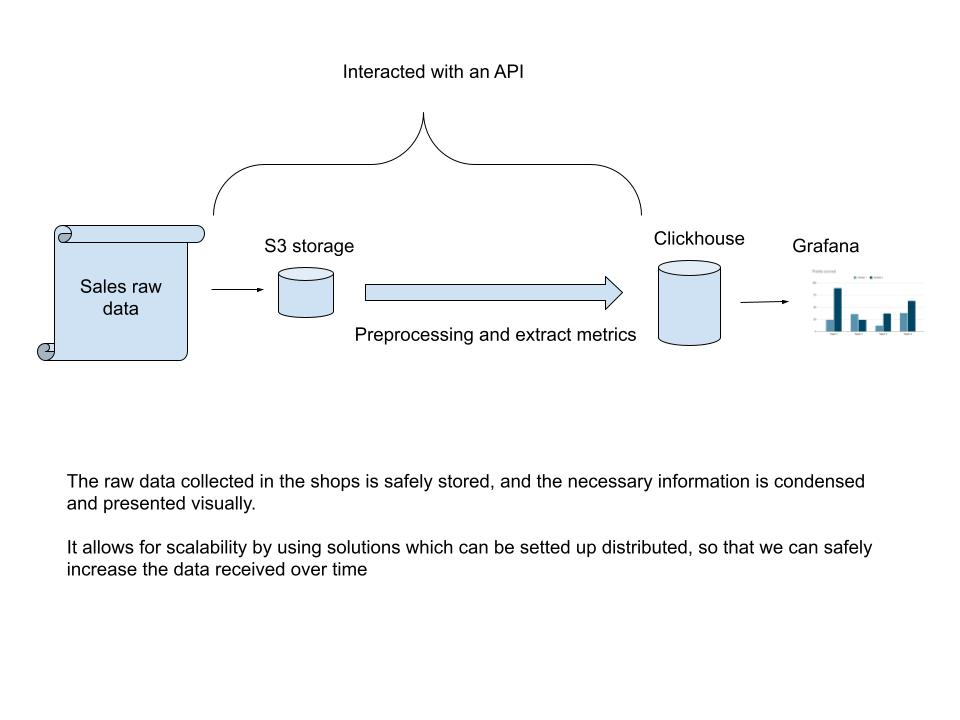

# **Sales Data Pipeline with Docker, ClickHouse, and Grafana**

This project sets up a scalable, containerized data pipeline for ingesting, processing, storing, and visualizing sales data. It leverages Minio S3 for raw data storage, ClickHouse for data analytics, and Grafana for visualizations.

---

## **Architecture Overview**



1. **Sales Raw Data**: Collected from various sources and stored in S3.
2. **Preprocessing and Metric Extraction**: Data is cleaned, processed, and transformed into metrics.
3. **ClickHouse**: Stores processed metrics and provides fast analytical queries.
4. **Grafana**: Visualizes the aggregated data using bar charts and dashboards.
5. **API Interaction**: The system can interact with APIs for data input/output.

---

## **Technologies Used**

- **Docker**: Containerization for the entire pipeline.
- **Docker Compose**: Orchestration for multiple containers.
- **Python**: For preprocessing and interacting with S3.
- **ClickHouse**: Analytical database for storing and querying metrics.
- **Grafana**: Dashboard tool for data visualization.
- **AWS S3**: Object storage for raw data.

---

## **Setup Instructions**

### **1. Prerequisites**

Ensure you have the following installed:

- [Docker](https://docs.docker.com/get-docker/)
- [Docker Compose](https://docs.docker.com/compose/install/)

---

### **2. Project Directory Structure**

```plaintext
project-root/
├── docker-compose.yml
├── backend.Dockerfile # Custom image for creating the API server
├── run_app.py # Flask API for interacting with S3 and ClickHouse
├── requirements.txt
├── file.csv   # Raw sales data (optional)
├── sales_dashboard.json # Graphana dashboard
└── diagram.jpg       # Architecture diagram
```

---

### **3. Build and Run the Containers**

1. **Build the Containers and start services:**
   ```bash
   docker-compose up -d
   ```

2. **Verify the Services:**
   - **Minio s3**: Accessible at `http://localhost:9001` (Credentials in docker-compose).
   - **ClickHouse**: Accessible at `http://localhost:8123`.
   - **Grafana**: Accessible at `http://localhost:3000` (default credentials: `admin/admin`).
   - **API documentation**: Accesible at `http://localhost:5000/swagger-ui/#/`

## **4. Usage**

### **Data Ingestion and Preprocessing:**

- Create a bucket to start uploading files:
   ```bash
   curl -X POST -H "Content-Type: application/json" -d '{"bucket_name": "bucket-name"}' http://localhost:5000/bucket
   ```
- Upload raw sales data to the S3 bucket, using the API. 
   ```bash
    curl -X POST -F "file=@file.csv" 'http://localhost:5000/ingest/sales?bucket_name=bucket-name'
   ```
- You can verify using:
   ```bash
    curl -X GET 'http://localhost:5000/buckets'
    
    curl -X GET 'http://localhost:5000/objects?bucket_name=bucket-name'
   ```

- To start the preprocessing, the following endpoint reads raw data from S3, processes it, and inserts metrics into ClickHouse.
   ```bash
    curl -X POST 'http://localhost:5000/transform/sales?bucket_name=bucket-name&file_name=file.csv'
   ```


### **Querying ClickHouse:**

- Use ClickHouse's SQL queries to analyze data. Example query:

   ```sql
   SELECT product_id, SUM(total_sales_sum) AS sum_sales
   FROM sales
   GROUP BY product_id
   ORDER BY sum_sales DESC;
   ```

### **Visualizing Data in Grafana:**

1. Log in to Grafana at `http://localhost:3000`.
2. Import the **sales_dashboard.json**.

---

## **5. Troubleshooting**

- **Check Logs:** 
   ```bash
   docker-compose logs <service_name>
   ```
- **Grafana Not Connecting:** Verify ClickHouse is accessible and configured as a data source in Grafana.
- **Data Not Processing:** Ensure the S3 endpoint and ClickHouse host settings are correct.
- **Permission Issues:** Verify file permissions and ensure all containers have access to the required volumes.
---

## **6. Customization**

- **ClickHouse Queries**: Modify or add custom queries in Grafana to fit your analysis needs.
- **Grafana Dashboards**: Customize dashboards by editing JSON or using the Grafana UI.
- **Preprocessing**: Adjust the preprocessing endpoint to include additional transformations or validation rules.

---

## **8. Future Enhancements**

- **S3 Storage**: Configure S3 credentials in the `.env` file or pass them as environment variables.
- **CI/CD Integration:** Add CI/CD pipelines for automated deployments and testing.
- **Security Enhancements:** Implement role-based access controls (RBAC) and secure API endpoints.
- **Scalability Improvements:** Configure a K8s cluster for running this resources in a distributed framework to handle large datasets.
- **Monitoring and Alerts:** Integrate monitoring tools to track the performance of the pipeline and set up alerts for failures.
